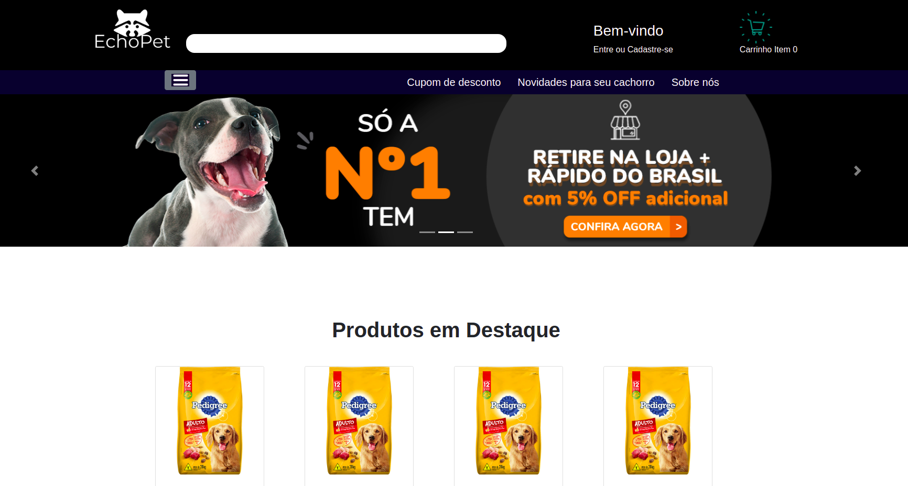

# E-commerce EchoPet 🦁 🐦

# Figma
https://www.figma.com/file/uSzNvWzY9Nh2RZrS5mZSwG/EchoPet?node-id=0%3A1

<h1> SPRINT 1 </h1>

 Os grupos deverão criar e pensar no sistema a ser desenvolvido. A ideia é documentar
wireframe de todas as páginas, funcionalidades principais da aplicação, fluxos e processos
para a facilitação do desenvolvimento.

 Para a documentação e criação dos layouts, podem ser utilizadas qualquer ferramenta,
porém deixamos como recomendação as seguintes: 

<ul> 
    <li> Adobe XD - Link: ​ https://www.adobe.com/br/products/xd.html  </li>
    <li> Figma - Link: ​ https://www.figma.com/  </li>
    <li> Canva - Link ​ https://www.canva.com/   </li>

</ul>

<h1> SPRINT 2 </h1>

 Agora que já pensamos no layout e identidade visual do nosso
projeto, essas ideias devem ser passadas para o código! 

 Deve ser entregue o front-end completo do sistema escolhido por
vocês, ou seja, todas as páginas. 

 É muito importante que o usuário tenha uma boa experiência tanto
    no computador, quanto no celular ou tablet. Atente-se a
    responsividade dos elementos e teste em diferentes dispositivos
    para garantir a qualidade da entrega. 

 Alguns links que podem ajudá-los nessa etapa: 

<ul>
    <li> Google Fonts - Link: https://fonts.google.com/ </li>
    <li> UnDraw (Ilustrações)- Link: https://undraw.co/illustrations  </li>
    <li> Freepik (ilustrações, ícones)- Link: https://br.freepik.com/  </li>
    <li>  Pexels (imagens) - Link: ​https://www.pexels.com/</li>
    <li> Adobe Color (criação paleta de cores)- Link: ​https://color.adobe.com/create </li>
</ul>

 Vale lembrar: ​ Não esperamos que apliquem nada além de HTML, CSS e
Bootstrap (caso o grupo opte por usá-lo). E, é provável que após
começarem a transformar o protótipo em código tenham novas ideias
para o layout, desde que todo o grupo concorde com as mudanças não há
problema algum! 

